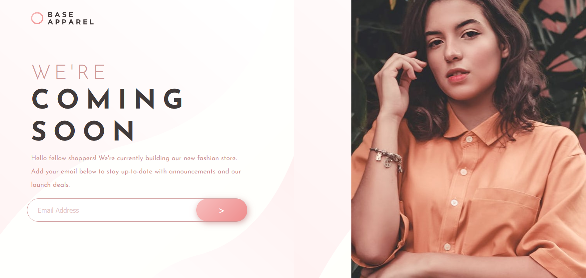
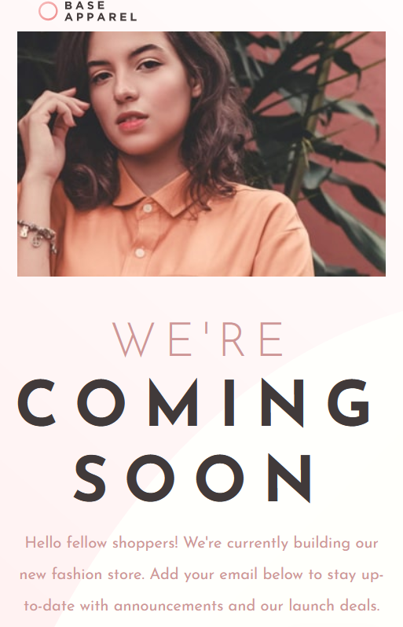

# Frontend Mentor - Base Apparel coming soon page solution

This is a solution to the [Base Apparel coming soon page challenge on Frontend Mentor](https://www.frontendmentor.io/challenges/base-apparel-coming-soon-page-5d46b47f8db8a7063f9331a0). Frontend Mentor challenges help you improve your coding skills by building realistic projects.

## Table of contents

- [Overview](#overview)
  - [The challenge](#the-challenge)
  - [Screenshot](#screenshot)
  - [Links](#links)
- [My process](#my-process)
  - [Built with](#built-with)
  - [What I learned](#what-i-learned)
  - [Continued development](#continued-development)
  - [Useful resources](#useful-resources)
- [Author](#author)
- [Acknowledgments](#acknowledgments)

## Overview

### The challenge

Users should be able to:

- View the optimal layout for the site depending on their device's screen size
- See hover states for all interactive elements on the page
- Receive an error message when the `form` is submitted if:
  - The `input` field is empty
  - The email address is not formatted correctly

### Screenshot





### Links

- Solution URL: [Github](https://github.com/elic4vet/base-apparel)
- Live Site URL: [Netlify](https://luminous-seahorse-265395.netlify.app/)

## My process

### Built with

- Semantic HTML5 markup
- CSS custom properties
- Flexbox
- CSS Grid
- Mobile-first workflow
- [Styled Components](https://styled-components.com/) - For styles

### What I learned

I learned more about CSS grid and how to use it. I also learned how to use the overlay on CSS. I really liked this pattern and will use it going forward. I also learned how to use the form and how to validate it.

To see how you can add code snippets, see below:

```html
<h1>Some HTML code I'm proud of</h1>
```

```css
.submit {
  width: 100%;
  height: 54px;
  border-radius: 50px;
  border: none;
  cursor: pointer;
  margin-left: -123px;
  width: 142px;
  background-image: linear-gradient(135deg, hsl(0, 80%, 86%), hsl(0, 74%, 74%));
  box-shadow: 2px 4px 14px hsla(0, 36%, 70%, 0.8);
  transition-duration: 0.3s;
  transition-property: transform, box-shadow;
  transition-timing-function: ease-in-out;
  color: white;
  font-weight: var(--fw-regular);
  font-size: 20px;
}
```

### Continued development

I want to continue focusing on CSS grid and how to use it. I also want to learn more about advanced concepts of Javascript and CSS. I will continue practising and building projects to improve my skills.

### Useful resources

- [Color overlay on hover image ](https://stackoverflow.com/questions/40292168/color-overlay-on-hover-image) - This helped me to understand how to use the overlay on CSS. I really liked this pattern and will use it going forward.

- [How to validate forms in React](https://www.youtube.com/watch?v=6TPYxLVq0FY) - This is an amazing video tutorial which helped me finally understand how to validate forms in React. I'd recommend it to anyone still learning this concept.

## Author

- Website - [Elisabeth Erkekoglou ](https://www.linkedin.com/in/eerkekoglou/)
- Frontend Mentor - [@elic4vet](https://www.frontendmentor.io/profile/elic4vet)
- Instagram - [@elisa.codes23](https://www.instagram.com/elisa.codes23/)
